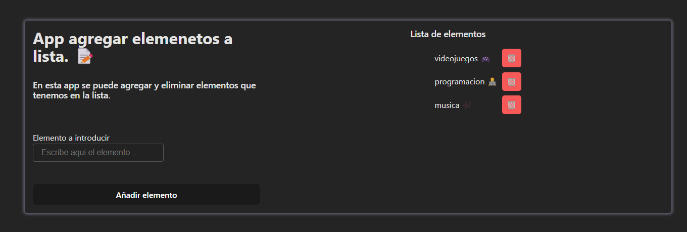

# Add Items React App

## Descripción

Esta es una aplicación desarrollada en React que permite a los usuarios agregar, visualizar y gestionar elementos en una lista. Es ideal para aprender y practicar conceptos básicos de React como el manejo del estado, eventos y componentes.

## Características

- Agregar elementos a una lista.
- Visualizar los elementos añadidos.
- Interfaz simple y fácil de usar.



## Tecnologías utilizadas

- **Lenguaje:** TypeScript
- **Framework:** React
- **Herramientas adicionales:** Vite (para el entorno de desarrollo)

## Instalación

1. Clona este repositorio:
  ```bash
  git clone https://github.com/JampierCaramantin/ReactListEmentsApp.git
  ```
2. Navega al directorio del proyecto:
  ```bash
  cd ReactListEmentsApp

  ```
3. Instala las dependencias:
  ```bash
  npm install
  ```
4. Inicia el servidor de desarrollo:
  ```bash
  npm run dev
  ```

## Uso

1. Abre la aplicación en tu navegador en `http://localhost:3000`.
2. Usa el formulario para agregar elementos a la lista.
3. Visualiza los elementos añadidos en tiempo real.

## Contribución

Si deseas contribuir, por favor sigue estos pasos:

1. Haz un fork del repositorio.
2. Crea una nueva rama:
  ```bash
  git checkout -b feature/nueva-funcionalidad
  ```
3. Realiza tus cambios y haz commit:
  ```bash
  git commit -m "Añadida nueva funcionalidad"
  ```
4. Sube tus cambios:
  ```bash
  git push origin feature/nueva-funcionalidad
  ```
5. Abre un Pull Request.

## Licencia

Este proyecto está bajo la licencia MIT. Consulta el archivo `LICENSE` para más detalles.